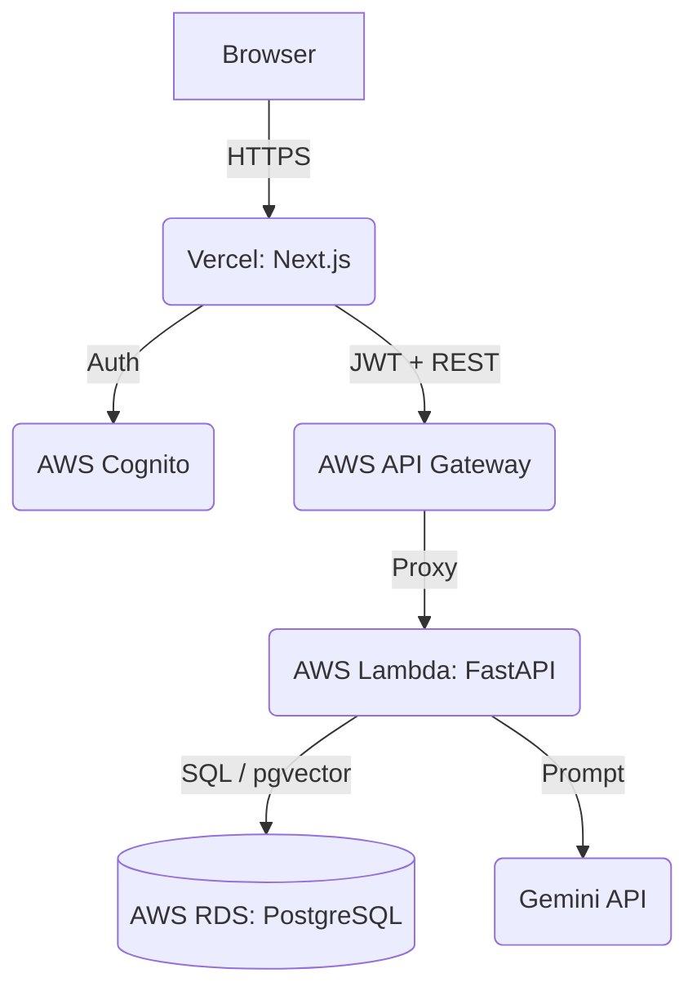

# FocusFlow AI

FocusFlow is an intelligent task breakdown and Pomodoro scheduling application. It uses Google's Gemini AI to break your raw ideas into actionable subtasks, schedules them into 25-minute work blocks, and leverages RAG (Retrieval-Augmented Generation) to analyze your past sessions and deliver actionable productivity insights.

---

## 🏛️ System Architecture

FocusFlow is a fully decoupled **Serverless Web Application**. 

- **Frontend:** Next.js (React) hosted on **Vercel** at the edge.
- **Backend:** FastAPI (Python) hosted on **AWS Lambda** via Docker containers.
- **API Gateway:** AWS HTTP API Gateway securely routing requests to Lambda.
- **Database:** PostgreSQL hosted on **AWS RDS**, utilizing the `pgvector` extension for AI embedding storage.
- **Authentication:** **AWS Cognito** for secure, scalable user management and JWT validation.
- **AI Engine:** **Google Gemini API** for structured output generation and embedding creation.

---

## 🚀 Quick Setup (Local & Production)

You can run FocusFlow entirely on your local machine using Docker, or deploy it fully to the AWS Cloud. 

Detailed, component-specific setup instructions are available in their respective directories:

1. **[Backend Documentation (FastAPI, Postgres, AWS)](./focusflow-backend/README.md)**
2. **[Frontend Documentation (Next.js, Vercel)](./focusflow-frontend/README.md)**

### Local Setup Summary
If you want to run the stack locally for development:
1. Start the PostgreSQL database locally using Docker (`pgvector/pgvector:pg16`).
2. Run the backend via `uvicorn app.main:app --reload` on port `8000`.
3. Run the frontend via `npm run dev` on port `3000`.
4. The frontend will communicate directly with `localhost:8000`.

### Production Deployment Summary
1. **Database:** Provision an AWS RDS Postgres database and manually enable the `pgvector` extension.
2. **Auth:** Create an AWS Cognito User Pool.
3. **Backend CI/CD:** GitHub Actions automatically builds the Python FastAPI Docker image, pushes it to AWS ECR, and updates the AWS Lambda function.
4. **Frontend CI/CD:** Vercel automatically builds and deploys the Next.js frontend on every `git push`.

---

## 🧠 Core Features

- **AI Task Breakdown:** "I want to build a website" automatically becomes 6 structured tasks with time estimates.
- **Dynamic Pomodoro Scheduler:** Automatically fits your tasks into your available time window (e.g., 9:00 AM to 5:00 PM), calculating exact start/end times and inserting 5-minute breaks.
- **Visual Timeline:** A completely custom UI rendering your day as proportional blocks rather than a standard calendar grid.
- **RAG Insights:** Ask "When was I most productive last week?" and FocusFlow uses vector search to find relevant past sessions and synthesizes an answer using Gemini.
